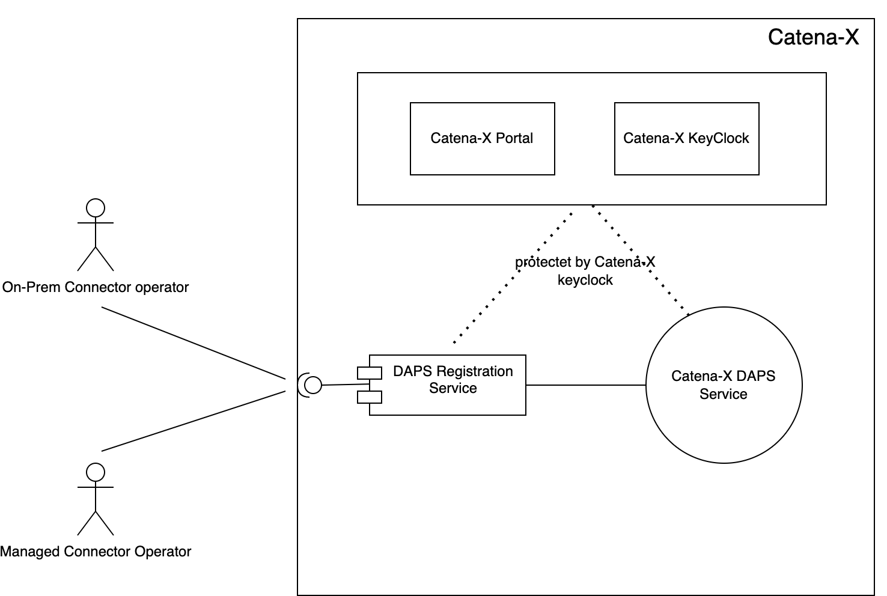
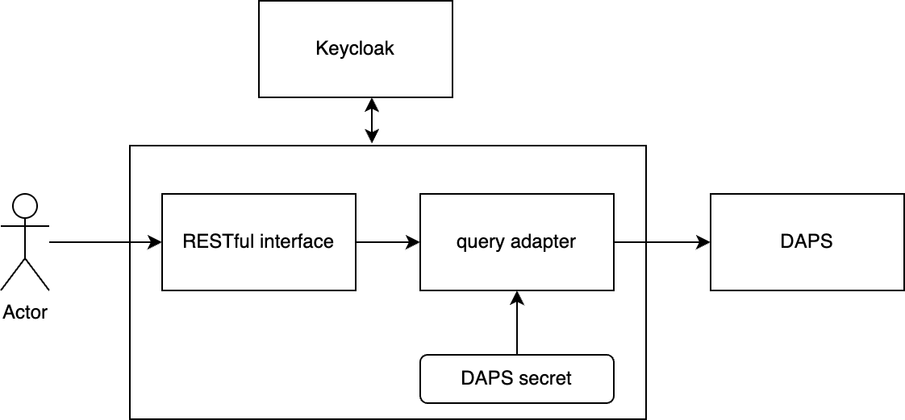
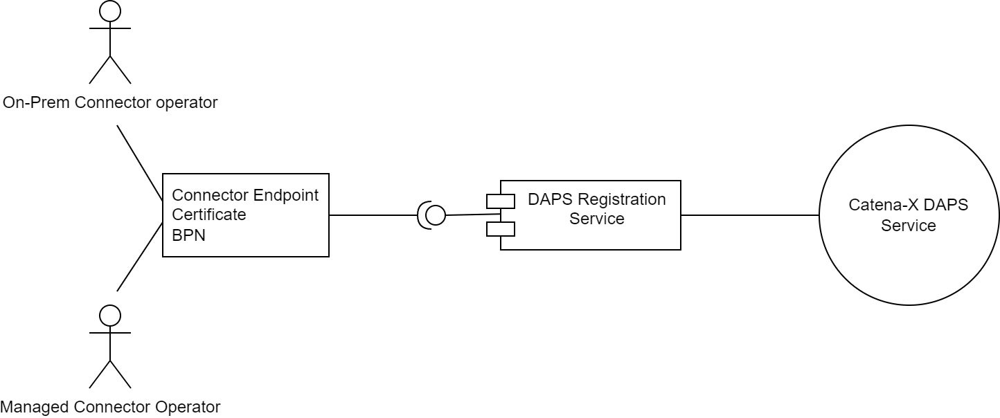

# ARC42 documentation DAPS registration service

Copied from Template Page ARC42

**Template**<br/>
2021-02-22<br/>
**About arc42**<br/>
arc42, the Template for documentation of software and system
architecture.<br/>
By Dr. Gernot Starke, Dr. Peter Hruschka and contributors.<br/>
Template Revision: 7.0 EN (based on asciidoc), January 2017<br/>
© We acknowledge that this document uses material from the arc 42
architecture template, <http://www.arc42.de>. Created by Dr. Peter
Hruschka & Dr. Gernot Starke.

This version of the template contains some help and explanations. It is
used for familiarization with arc42 and the understanding of the
concepts. For documentation of your own system you use better the
*plain* version.

# Introduction and Goals

DAPS Registration Service is a central Catena-X Service, which allows
registering connectors remotely in Catena-X DAPS service. This Service
can be used by all operators of connectors:

-   The operators of on-pram connector

-   Operators of managed connectors

## Requirements Overview

### High level requirement

DAPS registration service mediates the calls between authenticated
requestor and DAPS. It requires Keycloak and DAPS. A caller who manages
clients in DAPS shall be registered in DAPS and hold a role allowing him
to perform a call. Role names are configurable in DAPS registration
service configuration file.

## Quality Goals

The following table describes the key quality objectives of SDE.

| **Priority** | **Quality-Goal** | **Scenario**                                                     |
|--------------|------------------|------------------------------------------------------------------|
| 1            | Security         | Protecting API against unauthorized access. Protecting the Keys. |
| 1            | Integrity        | Authorized recipients/Users can only register a connector.       |
| 2            | Reliability      | The microservices are available 99.9999%.                        |
| 2            | Ease-of-use      | The DAPS registration service will provide ease-of-use API.      |


## Stakeholders

The following table illustrates the stakeholders of SDE and their
respective intentions.

| **Role/Name**                   | **Contact**                                                       | **Expectations** |
|---------------------------------|-------------------------------------------------------------------|------------------|
| System Architect / Werner       | [*werner.jost@t-systems.com*](mailto:werner.jost@t-systems.com)   |                  |
| Architect / Nizar Msadek        | [*nizar.msadek@t-systems.com*](mailto:nizar.msadek@t-systems.com) |                  |
| System Architect / Felix Gerbik | [*Felix.Gerbik@bmw.de*](mailto:Felix.Gerbik@bmw.de)               |                  |
| PO Portal                       | [*Julia.Jeroch@bmw.de*](mailto:Julia.Jeroch@bmw.de)               |                  |

# Architecture Constraints

Registration service can be running only under the Catena-X domain

# System Scope and Context

## 

## Business Context

DAPS registration service sits between DAPS service and Connector
Operator. DAPS service provides a remote configuration plugin on its
own, however, it relies on its own authentication system, based on
OpenID Connect, which is not directly compatible with the one used in
Catena-X. Registration service uses Catena-X\'s keycloak to authenticate
a caller. If the caller is authenticated and authorized (has an
appropriate role) then the call is transferred to the DAPS remote
configuration plugin. With this plugin, new clients can be registered or
unregistered at DAPS, and their registration details can be updated.

## Technical Context

### **Information needed for Connector registration in DAPS:**

-   The endpoint of the DAPS registration service

-   Connector certificate (see How to create a certificate)

-   The endpoint of the connector (possible BPN of the connector if need
    to include it in the DAT. In this case, BPN is added at the end of
    referringConnector)

## How to create a certificate:

**For release 2 we use self-sign certificate:**

To create self signed certificate, please follow the below steps.

-   ```openssl req -x509 -sha256 -days 365 -nodes -newkey rsa:2048 -keyout connector-example.key -out connector-example.crt```

-   ```openssl pkcs12 -export -name 1 -out connector-example.p12 -inkey connector-example.key -in connector-example.crt```

-   ```openssl rsa -in connector-example.key -pubout -out connector-example.pub```

-   Send us the .crt file, url and fqdn name to process for registration
    in DAPS.

## DAPS Registration API:

To register a Certificate to the DAPS an authenticated client (known
client with an appropriate role, a concrete role can be configured in
the configuration file) sends POST multipart request to the DAPS
registration service endpoint

Media Type: multipart/form-data

POST /api/v1/daps

here is the interface definition in java:

```
public void createClient(
		@RequestParam String clientName,
		@RequestParam(required = false) String securityProfile,
		@RequestParam(required = false) String referringConnector,
		@RequestPart("file") MultipartFile file)
```
parameters securityProfile and referringConnector are optional, for
securityProfile the default value is used, if referringConnector is
missed than it is not included in DAT

OpenAPI documentation for the service is given bellow:

**OpenAPI-yaml**

```yaml
openapi: 3.0.3
info:
  title: DAPS Registration Service API
  description: An admin interface to the Omeijdn DAPS Server
  version: 1.0.4
servers:
  - url: /api/v1
paths:
  /daps:
    post:
      summary: Creates a Client at DAPS
      operationId: createClientPost
      security:
        - bearerAuth: []
      requestBody:
        required: true
        content:
          multipart/form-data:
            schema:
              type: object
              properties:
                clientName:
                  type: string
                  description: Name of a client we create a record for
                securityProfile:
                  type: string
                  description: The profile. Default value is idsc:BASE_SECURITY_PROFILE
                referringConnector:
                  type: string
                  format: uri
                  description: URL of a connector with BPN at the end
                file:
                  type: string
                  format: binary
                  description: Certificate of a Connector in PEM format
              required:
                - clientName
                - referringConnector
                - file
      responses:
        '201':
          description: Created

  /daps/{client_id}:
    get:
      summary: Gets a client by ID.
      operationId: getClientGet
      security:
        - bearerAuth: [ ]
      parameters:
        - name: client_id
          in: path
          description: Client ID
          required: true
          schema:
            type: string
      responses:
        '200':
          description: Client details
          content:
            application/json:
              schema:
                type: object
                additionalProperties: {}
    put:
      summary: Updates a client by ID.
      operationId: updateClientPut
      security:
        - bearerAuth: [ ]
      parameters:
        - name: client_id
          in: path
          description: Client ID
          required: true
          schema:
            type: string
        - name: newAttr
          in: query
          description: Attributes to add
          required: true
          schema:
            type: object
            additionalProperties:
              type: string
      responses:
        '200':
          description: Client updated
    delete:
      summary: Delete a client by ID.
      operationId: deleteClientDelete
      security:
        - bearerAuth: [ ]
      parameters:
        - name: client_id
          in: path
          description: Client ID
          required: true
          schema:
            type: string
      responses:
        '204':
          description: Client deleted
components:
  securitySchemes:
    bearerAuth: # arbitrary name for the security scheme
      type: http
      scheme: bearer
      bearerFormat: JWT    # optional, arbitrary value for documentation purposes
security:
  - bearerAuth: []
```

Human-readable render of that documentation is available at
https://drs-pen.int.demo.catena-x.net/swagger-ui/index.html

## Solution Strategy

For user authentication, Connector Registration Service relies on the
Catena-X identity provider (keycloak). Connector Registration Service
has access to a secret that allows using the remote administration
plugin of the DAPS.

## Building Block View

 

## Whitebox Overall System

-   RESTful interface receives requests from an actor for creating,
    updating, and deleting clients at DAPS. The request needs to be
    authenticated and authorised in order to proceed. Catena-X keycloak
    is used for authentication purposes
    
-   Query adapter transforms a request coming from Actor to the format
    acceptable by DAPS remote administration plugin

-   DAPS secret allows the query adapter to call DAPS and perform admin
    operations on it. Thus, we keep this secret on the Registration
    Service side and do not disclose it to the Actor

## Runtime View



## Deployment View

In Catena-X we use [ARGO-CD](https://confluence.catena-x.net/display/ARTI/ArgoCD+deployment+tool)
for deployment

[README.md](README.md) describe the deployment process

# Quality Requirements

See Quality Gates 4

# Glossary

| Term                                                                                                     | Description                                                                                                                                                                                                                                                                     |
|----------------------------------------------------------------------------------------------------------|---------------------------------------------------------------------------------------------------------------------------------------------------------------------------------------------------------------------------------------------------------------------------------|
| Gaia-X                                                                                                   | Gaia-X represents the next generation of data infrastructure ecosystem: an open,transparent, and secure digital ecosystem, where data and services can be made available, collated and  shared in an environment of trust.                                                      |
| Catalogue                                                                                                | A Catalogue presents a list of available Service Offerings. Catalogues are the main building blocks for the publication and discovery of Self-Descriptions for Service Offerings by the Participants.                                                                           |
| (Catena-X Data Space)                                                                                    | A Data Space is a virtual data integration concept defined as a set of participants and a set of relationships among them, where participants provide their data resources and computing services.                                                                              |
| Catena-X  Portal /  Onboarding Process                                                                   | The portal is used for the registration/onboarding process in Catena-X and includes the login, user management and the initial registration.                                                                                                                                    |
| Claim                                                                                                    | An assertion made about a subject.                                                                                                                                                                                                                                              |
| [Custodian Wallet](https://confluence.catena-x.net/display/CORE/Registration-Service)/ Catena-X wallet   | interface which is used to share the company name as The Custodian Wallet interface is a cross product well as the company bpn to the custodian service. The service is using those data to create a new wallet for the company. The wallet will hold the company name and bpn. |
| Decentralized Identifier (DID)                                                                           | Decentralized Identifiers are a new type of identifiers that enables verifiable, decentralized digital identity.                                                                                                                                                                |
| Federated Services                                                                                       | Federation Services are services required for the operational implementation of a Gaia-X Data Ecosystem.                                                                                                                                                                        |
| Federation                                                                                               | A Federation refers to a loose set of interacting actors that directly or indirectly consume, produce, or provide resources.                                                                                                                                                    |
| Holder                                                                                                   | Is the user that holds the verifiable credentials.                                                                                                                                                                                                                              |
| Issuer                                                                                                   | Is an instance that can issue verifiable  credentials.                                                                                                                                                                                                                          |
| Keycloak                                                                                                 | Keycloack is an open-source Identity Management and Access management solution that allows Single Sign-On.                                                                                                                                                                      |
| Self-Description                                                                                         | A machine-readable File (json-lD) that contains description about Participants and Services.                                                                                                                                                                                    |
| [Self-Description Factory](https://confluence.catena-x.net/display/ARTI/ARC42-+Self+Description+Factory) | SD-Factory creates a Verifiable Credential based on the information taken from OS, unlocks Private Key from CX-wallet and signs it with Catena-X key.                                                                                                                           |
| Self-Description Graph                                                                                   | The Self-Description Graph contains the information imported from the Self-Descriptions that are known to the Catalogue and have an "active" lifecycle state.                                                                                                                   |
| [Self-Description Hub](https://confluence.catena-x.net/display/ARTI/Self+Description+Hub)                | The Self-Description Hub\'s (SD Hub) store Self Descriptions in order to provide a flat catalogue of SDs.                                                                                                                                                                       |                                                  
| [Self-Description Validator](https://confluence.catena-x.net/display/ARTI/ARC42-+Self+Description+Hub)   | The Self-Description validator is provided by Gaia-X. With that any Self Descriptions can be checked against an instance of the validator.                                                                                                                                      |
| (Verifiable)  Credential                                                                                 | A set of one or more Claims made and asserted by an issuer.                                                                                                                                                                                                                     |
| Verifiable Presentation                                                                                  | The expression of a subset of one\'s persona is called a verifiable presentation.                                                                                                                                                                                               |
| Verifier                                                                                                 | Is an instance that verifies the verifiable credentials of the holder.                                                                                                                                                                                                          |                         
